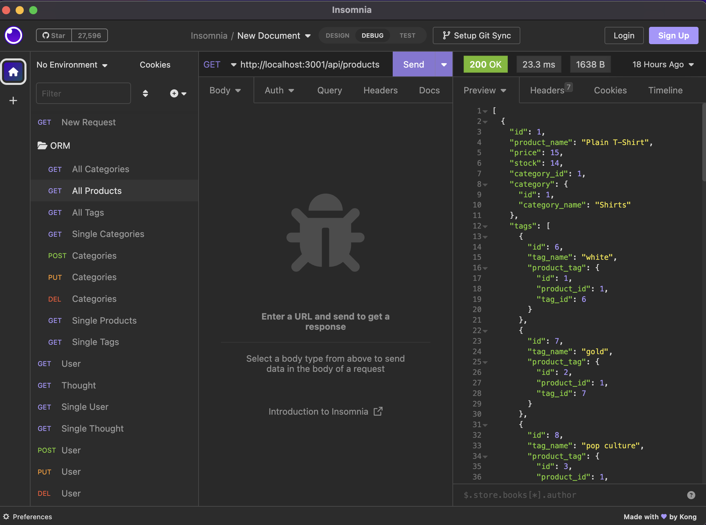
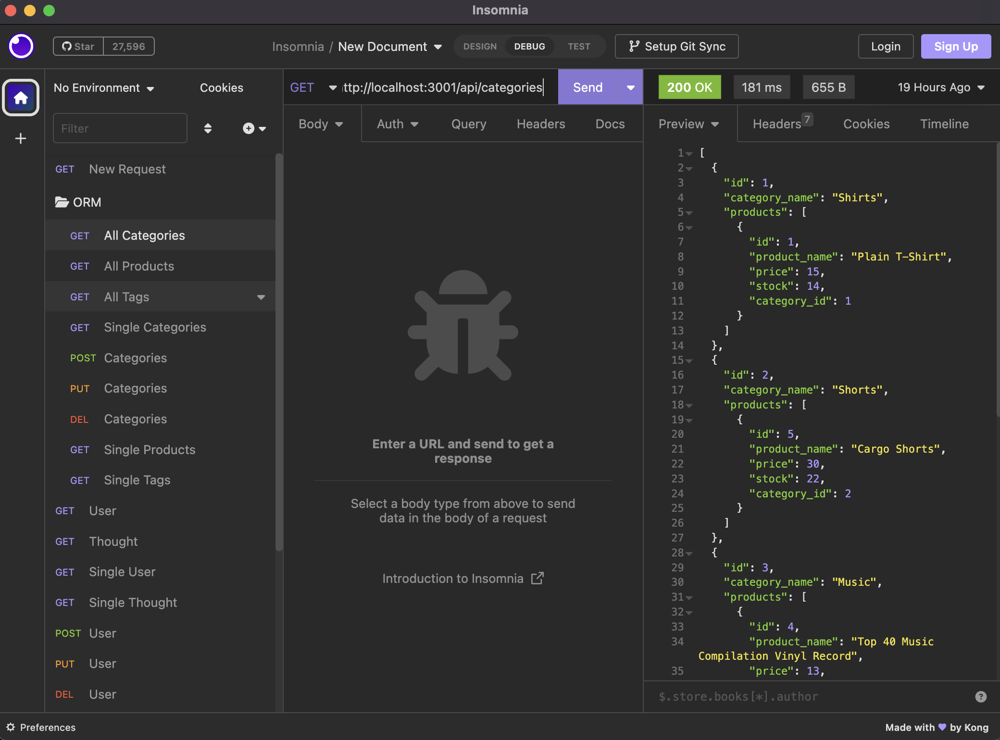

# ORM_eCommerce_Back_End

## Author

[Riley Altenburg](RileyAltenburg@gmail.com)

If you'd like to connect me, please email me!

## Description

My Motivation for the project was to understand backend servers while utilizing express.js APIs and using Sqeuelize to get to our MySQL database

The project was built to create a responsive local server that can manage an Ecommerce structure. This project will grab objects by different ids, by many or by a single product/catergory.

This taught how to use Object Relational Mappers (ORM) to navigate our databases and how we can have everything connected to flow very easily.

What I learned from this project was how to use API routing and ORM when using express.js and Sequlize to manage the databases.

## Installation

You must Run `npm i` to install all package dependencies,
Once everthing is fully downloaded you will run `node server.js` to start your local server. After that you can use a tool like Insomnia to hit the endpoints and test them out!

## DEMO

The program runs as follows:

## Licensing

This project is licensed under the MIT License.
